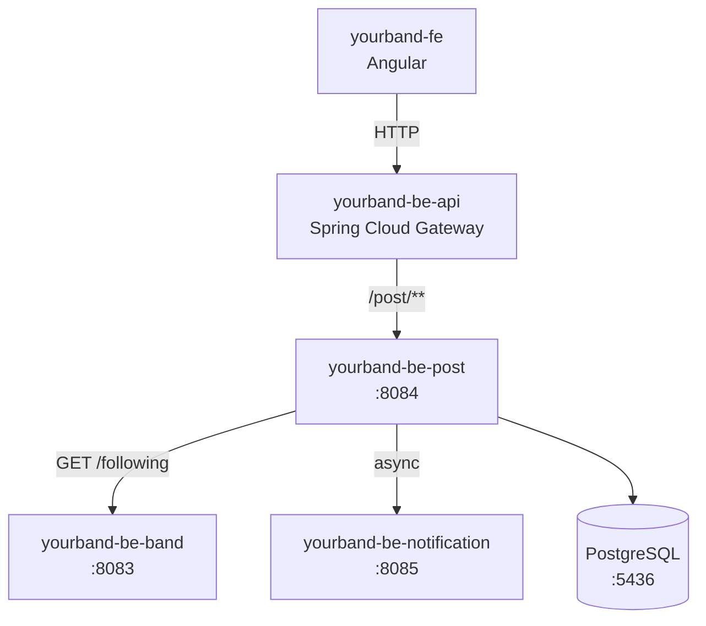

# yourband-be-post

Microservicio de publicaciones para la plataforma **YourBand** — red social para músicos.

## ¿Qué hace?

- CRUD de posts (texto, imagen, video de YouTube)
- Feed cronológico de posts de las bandas que sigue el usuario
- Sistema de likes
- Sistema de comentarios
- Notifica a `be-notification` de forma asíncrona ante likes y comentarios

## Arquitectura general



## Flujo del Feed


## Tecnologías

| Tecnología | Uso |
|---|---|
| Java 21 | Lenguaje |
| Spring Boot 3.3.5 | Framework principal |
| Spring MVC | API REST |
| Spring Data JPA | Persistencia |
| PostgreSQL 16 | Base de datos (puerto 5436) |
| Lombok | Reducción de boilerplate |
| Maven | Build tool |

## Endpoints principales

| Método | Ruta | Descripción |
|---|---|---|
| `GET` | `/v1/posts/feed` | Feed del usuario (bandas seguidas, orden cronológico) |
| `GET` | `/v1/posts/band/{bandId}` | Posts de una banda específica |
| `POST` | `/v1/posts` | Crear post |
| `DELETE` | `/v1/posts/{id}` | Eliminar post |
| `POST` | `/v1/posts/{id}/likes` | Dar like |
| `DELETE` | `/v1/posts/{id}/likes` | Quitar like |
| `GET` | `/v1/posts/{id}/comments` | Listar comentarios (paginado) |
| `POST` | `/v1/posts/{id}/comments` | Agregar comentario |
| `DELETE` | `/v1/posts/{postId}/comments/{commentId}` | Eliminar comentario |

> Todos los endpoints requieren el header `X-User-Id` (inyectado por el gateway).

## Modelo de datos


## Configuración

```properties
server.port=8084
server.servlet.context-path=/post
spring.datasource.url=jdbc:postgresql://localhost:5436/yourband_post_db
services.band.url=http://localhost:8083/band
services.notification.url=http://localhost:8085/notification
```

## Cómo correr

```bash
mvn spring-boot:run
```

Requiere PostgreSQL corriendo en el puerto `5436`. Podés levantarlo con:

```bash
docker-compose up postgres-post -d
```
