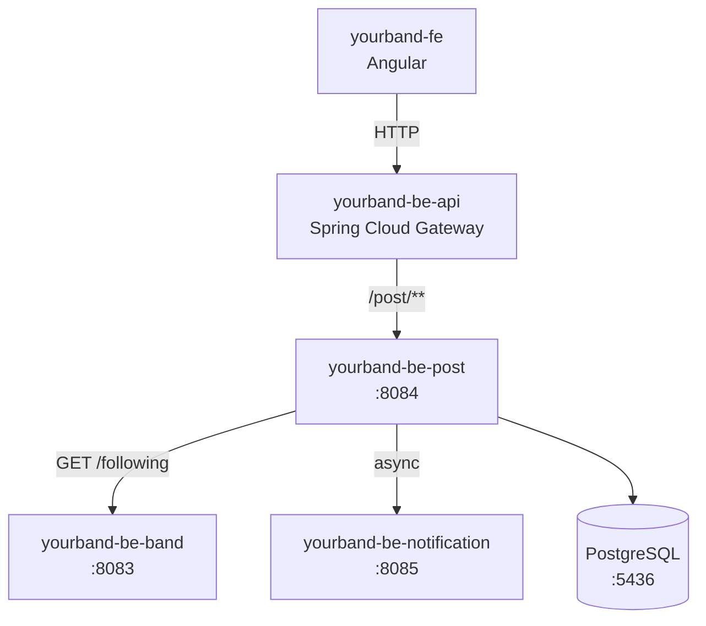
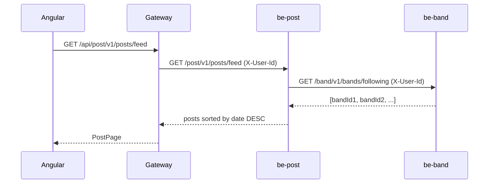
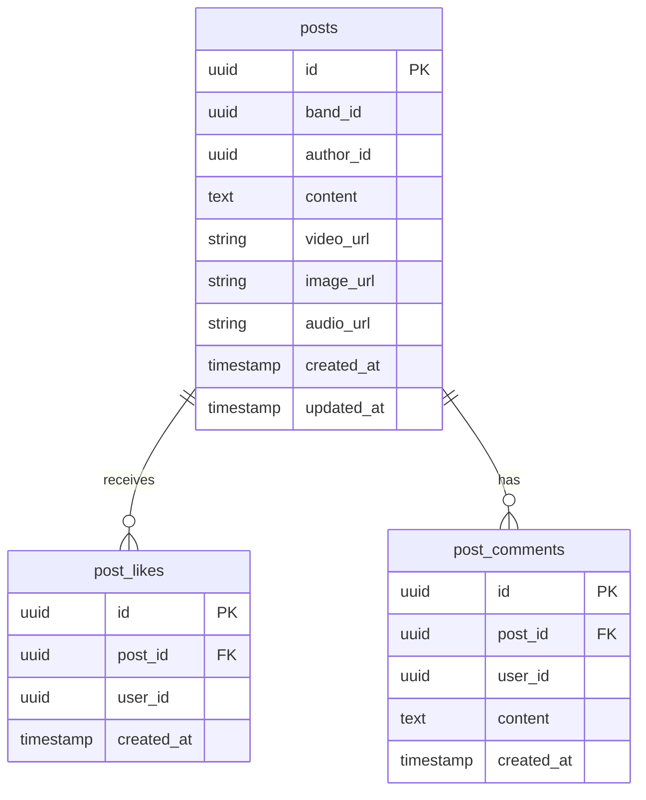

# yourband-be-post

Post management microservice for the **YourBand** platform — a social network for musicians.

## What does it do?

- Full CRUD for posts (text, image, YouTube video)
- Chronological feed of posts from bands the user follows
- Like system
- Comment system
- Asynchronously notifies `be-notification` on likes and comments

## Architecture



## Feed Flow



## Tech Stack

| Technology | Purpose |
|---|---|
| Java 21 | Language |
| Spring Boot 3.3.5 | Main framework |
| Spring MVC | REST API |
| Spring Data JPA | Persistence |
| PostgreSQL 16 | Database (port 5436) |
| Lombok | Boilerplate reduction |
| Maven | Build tool |

## Main Endpoints

| Method | Path | Description |
|---|---|---|
| `GET` | `/v1/posts/feed` | User feed (followed bands, chronological order) |
| `GET` | `/v1/posts/band/{bandId}` | Posts from a specific band |
| `POST` | `/v1/posts` | Create a post |
| `DELETE` | `/v1/posts/{id}` | Delete a post |
| `POST` | `/v1/posts/{id}/likes` | Like a post |
| `DELETE` | `/v1/posts/{id}/likes` | Unlike a post |
| `GET` | `/v1/posts/{id}/comments` | List comments (paginated) |
| `POST` | `/v1/posts/{id}/comments` | Add a comment |
| `DELETE` | `/v1/posts/{postId}/comments/{commentId}` | Delete a comment |

> All endpoints require the `X-User-Id` header (injected by the gateway).

## Data Model



## Configuration

```properties
server.port=8084
server.servlet.context-path=/post
spring.datasource.url=jdbc:postgresql://localhost:5436/yourband_post_db
services.band.url=http://localhost:8083/band
services.notification.url=http://localhost:8085/notification
```

## Running locally

```bash
mvn spring-boot:run
```

Requires PostgreSQL running on port `5436`. Start it with:

```bash
docker-compose up postgres-post -d
```
